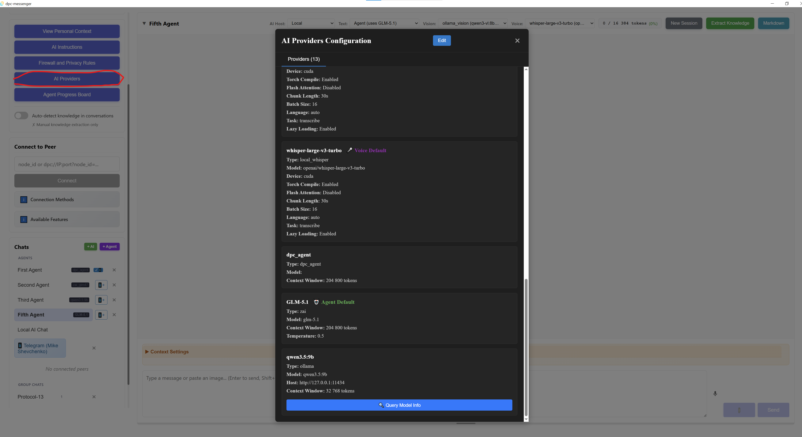
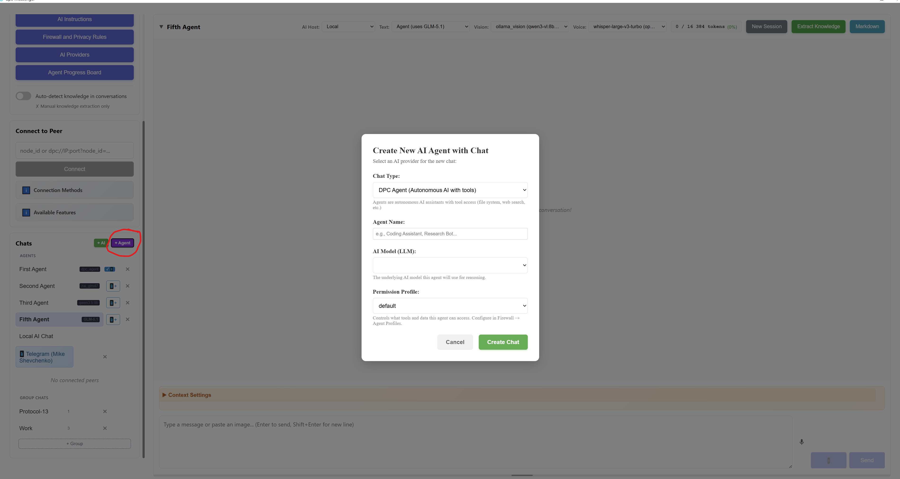

# D-PC Messenger Quick Start Guide

> **Status:** Alpha | **Platforms:** Windows, Linux, macOS | **Time:** 15-30 minutes

D-PC Messenger is a private space where people and their AI agents work together, build knowledge, and communicate directly — no servers, no cloud.

**This guide:** install tools → clone → run → use app in UI.

Pick your operating system:
- [Windows](#windows)
- [macOS](#macos)
- [Linux](#linux)

---

## Windows

### Step 1: Install tools

```powershell
winget install Python.Python.3.12
pip install uv
winget install OpenJS.NodeJS.LTS
```

Install Rust from [rustup.rs](https://rustup.rs/) (download and run the installer).

### Step 2: Clone and install

```powershell
git clone https://github.com/mikhashev/dpc-messenger.git
cd dpc-messenger

cd dpc-client/core
uv sync

cd ../ui
npm install
```

### Step 3: Run

Open **two terminals:**

**Terminal 1 — Backend:**

```powershell
cd dpc-client/core
uv run python run_service.py
```

**Terminal 2 — Frontend:**

```powershell
cd dpc-client/ui
npm run tauri dev
```

A desktop window will open — that's the app.

Your private data is stored in `C:\Users\<YourName>\.dpc\`. See [What gets created](#whats-in-dpc) below for details.

---

## macOS

### Step 1: Install tools

```bash
brew install python@3.12
pip3 install uv
brew install node
brew install rustup && rustup-init
```

### Step 2: Clone and install

```bash
git clone https://github.com/mikhashev/dpc-messenger.git
cd dpc-messenger

cd dpc-client/core
uv sync

cd ../ui
npm install
```

### Step 3: Run

Open **two terminals:**

**Terminal 1 — Backend:**

```bash
cd dpc-client/core
uv run python run_service.py
```

**Terminal 2 — Frontend:**

```bash
cd dpc-client/ui
npm run tauri dev
```

A desktop window will open — that's the app.

Your private data is stored in `~/.dpc/`. See [What gets created](#whats-in-dpc) below for details.

---

## Linux

### Step 1: Install tools

```bash
sudo apt install python3.12 python3.12-venv
pip3 install uv
sudo apt install nodejs npm
curl --proto '=https' --tlsv1.2 -sSf https://sh.rustup.rs | sh
```

Voice recording requires:
```bash
sudo apt install libasound2-dev pkg-config libpulse-dev
```

### Step 2: Clone and install

```bash
git clone https://github.com/mikhashev/dpc-messenger.git
cd dpc-messenger

cd dpc-client/core
uv sync          # NVIDIA GPU: installs CUDA torch automatically

cd ../ui
npm install
```

### Step 3: Run

Open **two terminals:**

**Terminal 1 — Backend:**

```bash
cd dpc-client/core
uv run python run_service.py
```

**Terminal 2 — Frontend:**

```bash
cd dpc-client/ui
npm run tauri dev
```

A desktop window will open — that's the app. 

Your private data is stored in `~/.dpc/`.

**AMD GPU (ROCm):** If you have an AMD GPU and want GPU-accelerated inference:
```bash
cd dpc-client/core
uv pip install torch torchvision --index-url https://download.pytorch.org/whl/rocm6.2
```

---

## What's in `.dpc`?

Your data is stored in `~/.dpc/` (Windows: `C:\Users\<YourName>\.dpc\`). Here's what gets created on first run:

| File | What it is | How to configure | Example |
|------|------------|-----------------|---------|
| `node.key`, `node.crt`, `node.id` | Your cryptographic identity | Auto-generated, don't edit | — |
| `config.ini` | Ports, timeouts, feature toggles | Edit manually or leave defaults | — |
| `providers.json` | AI provider config (defaults to Ollama) | UI: click **"AI Providers"** in sidebar | [providers.example.json](./dpc-client/providers.example.json) |
| `privacy_rules.json` | Firewall — who can see what | UI: click **"Firewall Rules"** in sidebar | [privacy_rules.example.json](./dpc-client/privacy_rules.example.json) |
| `personal.json` | Your profile and context | UI: click **"Personal Context"** in sidebar | [personal_context_example.json](./dpc-client/personal_context_example.json) |
| `device_context.json` | Your hardware/software info | Auto-collected, no action needed | [device_context_example.json](./dpc-client/device_context_example.json) |

Other folders (`knowledge/`, `conversations/`, `agents/`, `logs/`) are created automatically as you use the app.

---

## Configure an AI provider

The agent needs an AI model to think with. Configure at least one
provider before creating an agent — otherwise the model dropdown in
the next step will be empty.



1. In the sidebar, click **AI Providers**.
2. Pick a provider type from the dropdown:
   - **Ollama** — local models, no API key needed. Install
     [Ollama](https://ollama.com) first, then pull a model
     (e.g. `ollama pull llama3`).
   - **Anthropic** — Claude models. Needs an Anthropic API key.
   - **Z.AI** — GLM models. Needs a Z.AI API key.
   - other cloud providers, each needs its own key.
3. Fill the fields that appear (model name, API key, base URL as
   applicable) and save.
4. The provider shows up in the list and becomes available as a
   model choice when you create an agent.

You can add several providers and pick between them per agent later.

---

## Create your first AI agent

With at least one provider configured, add an agent to chat with.
The agent lives in the same window as your regular chats — you
create it once and it stays in the sidebar.



1. In the **Chats** panel on the left, click **+ Agent**.
2. In the dialog that opens:
   - **Chat Type:** leave as *DPC Agent (Autonomous AI with tools)*.
   - **Agent Name:** anything you like (e.g. *Ark*, *Helper*).
   - **AI Model (LLM):** pick one of the providers you configured
     in the previous step.
   - **Permission Profile:** *default* is fine for a first run. The
     agent can read files, search the web, and update its own
     memory, but cannot write to your files or take destructive
     actions. See [Agent reference](./docs/agent/DPC_AGENT_GUIDE.md)
     for per-tool control.
3. Click **Create Chat**.
4. The new agent appears in the sidebar. Click it to open the chat
   and send a first message — you should get a reply within a few
   seconds.

That's it. You now have a private AI agent running locally on your
machine, with the Firewall deciding what it can and cannot see.

---

## Next steps

Once your agent is answering, these guides go deeper on what it can
do:

- **[Agent reference → `docs/agent/DPC_AGENT_GUIDE.md`](./docs/agent/DPC_AGENT_GUIDE.md)** — tools, profiles, storage, troubleshooting
- **[Skills → `docs/agent/DPC_AGENT_SKILLS.md`](./docs/agent/DPC_AGENT_SKILLS.md)** — teach the agent multi-step strategies
- **[Telegram → `docs/agent/DPC_AGENT_TELEGRAM.md`](./docs/agent/DPC_AGENT_TELEGRAM.md)** — talk to your agent from Telegram
- **[Claude Code → `docs/agent/CC_INTEGRATION_GUIDE.md`](./docs/agent/CC_INTEGRATION_GUIDE.md)** — connect Claude Code as a second participant in the same chat

---

<div align="center">

**[Back to README](./README.md)** | **[Documentation](./docs/)**

</div>
