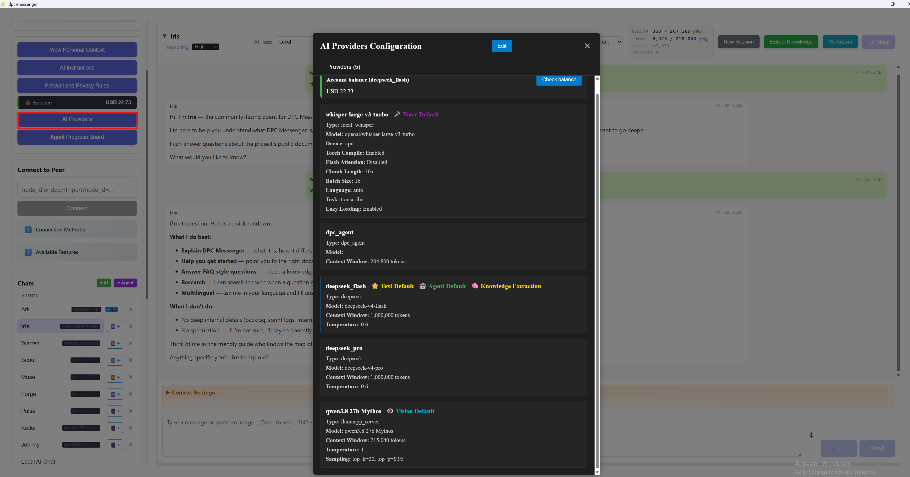
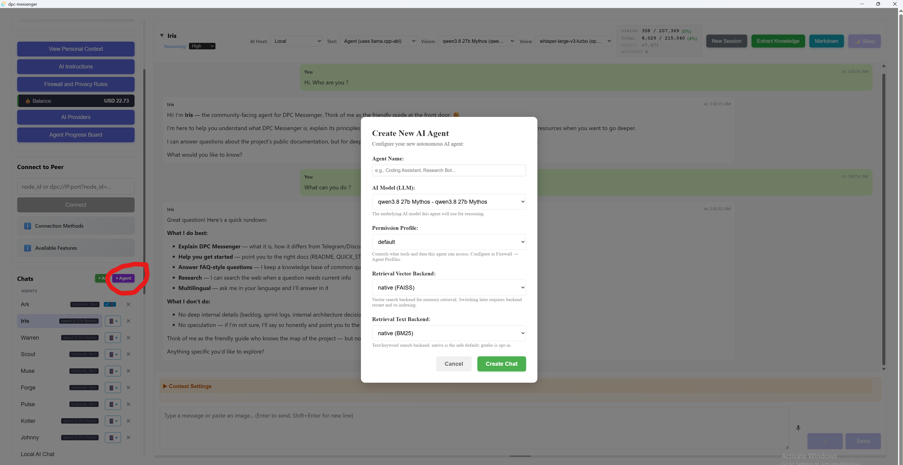

# D-PC Messenger Quick Start Guide

> **Status:** Alpha | **Platforms:** Windows, Linux, macOS | **Time:** 15-30 minutes

D-PC Messenger is a private space where people and their AI agents work together, build knowledge, and communicate directly — no servers, no cloud.

**This guide:** install tools → clone → run → use app in UI.

Pick your operating system:
- [Windows](#windows)
- [macOS](#macos)
- [Linux](#linux)

---

## Windows

### Step 1: Install tools

```powershell
winget install Python.Python.3.12
pip install uv
winget install OpenJS.NodeJS.LTS
```

Install Rust from [rustup.rs](https://rustup.rs/) (download and run the installer).

> **Build prerequisites (Windows):** the frontend (`npm run tauri dev`)
> compiles Rust, which needs the **MSVC C++ Build Tools**. The rustup
> installer prompts to install them — accept it. **WebView2** (required
> by Tauri) is preinstalled on Windows 11; on Windows 10 install it from
> Microsoft if the app window stays blank.

### Step 2: Clone and install

```powershell
git clone https://github.com/mikhashev/dpc-messenger.git
cd dpc-messenger

cd dpc-client/core
uv sync

cd ../ui
npm install
```

> **NVIDIA GPU users:** `uv sync` installs a CUDA build of PyTorch. If
> you have a very new card (Blackwell — RTX 50-series, RTX PRO 4500,
> etc.) and later see a `sm_120 is not compatible` warning, see
> [GPU acceleration](#gpu-acceleration) below for the one-line fix.

### Step 3: Run

Open **two terminals:**

**Terminal 1 — Backend:**

```powershell
cd dpc-client/core
uv run python run_service.py
```

**Terminal 2 — Frontend:**

```powershell
cd dpc-client/ui
npm run tauri dev
```

A desktop window will open — that's the app.

Your private data is stored in `C:\Users\<YourName>\.dpc\`. See [What gets created](#whats-in-dpc) below for details.

---

## macOS

### Step 1: Install tools

```bash
brew install python@3.12
pip3 install uv
brew install node
brew install rustup && rustup-init
```

### Step 2: Clone and install

```bash
git clone https://github.com/mikhashev/dpc-messenger.git
cd dpc-messenger

cd dpc-client/core
uv sync

cd ../ui
npm install
```

### Step 3: Run

Open **two terminals:**

**Terminal 1 — Backend:**

```bash
cd dpc-client/core
uv run python run_service.py
```

**Terminal 2 — Frontend:**

```bash
cd dpc-client/ui
npm run tauri dev
```

A desktop window will open — that's the app.

Your private data is stored in `~/.dpc/`. See [What gets created](#whats-in-dpc) below for details.

---

## Linux

### Step 1: Install tools

```bash
sudo apt install python3.12 python3.12-venv
pip3 install uv
sudo apt install nodejs npm
curl --proto '=https' --tlsv1.2 -sSf https://sh.rustup.rs | sh
```

Voice recording requires:
```bash
sudo apt install libasound2-dev pkg-config libpulse-dev
```

### Step 2: Clone and install

```bash
git clone https://github.com/mikhashev/dpc-messenger.git
cd dpc-messenger

cd dpc-client/core
uv sync          # NVIDIA GPU: installs CUDA torch automatically

cd ../ui
npm install
```

### Step 3: Run

Open **two terminals:**

**Terminal 1 — Backend:**

```bash
cd dpc-client/core
uv run python run_service.py
```

**Terminal 2 — Frontend:**

```bash
cd dpc-client/ui
npm run tauri dev
```

A desktop window will open — that's the app. 

Your private data is stored in `~/.dpc/`.

---

## First run: model downloads

The first time an agent uses its memory, the backend downloads an
embedding model (`BAAI/bge-m3`, ~2.3 GB) from Hugging Face. This needs
an internet connection and can make the first launch — and the first
click on some UI panels — appear to **hang for a minute or two**. This
is normal, happens **once**, and the model is cached in
`~/.cache/huggingface/` and reused afterward.

---

## GPU acceleration

`uv sync` installs a CUDA build of PyTorch for NVIDIA GPUs (used for
local Whisper transcription and agent-memory embeddings). No NVIDIA GPU?
The app still runs — PyTorch falls back to CPU, just slower.

**Troubleshooting — `NVIDIA ... with CUDA capability sm_120 is not
compatible` or `no kernel image is available for execution on the
device`:** your PyTorch build is older than your GPU (common on brand-new
**Blackwell** cards). Check your GPU with `nvidia-smi`, then reinstall
PyTorch from a newer CUDA index. For Blackwell (compute capability 12.0),
use `cu128`:

```bash
cd dpc-client/core
uv pip install --index-url https://download.pytorch.org/whl/cu128 "torch>=2.7" torchvision
```

Note: `Loaded ... on cuda` in the logs does **not** confirm the GPU
works — allocation can succeed while compute kernels are missing. Verify
with a quick `torch.randn(64,64,device="cuda") @ ...` if unsure.

**AMD GPU (Linux/ROCm):**

```bash
cd dpc-client/core
uv pip install torch torchvision --index-url https://download.pytorch.org/whl/rocm6.2
```

---

## Optional features

The default `uv sync` stays lean. Extras add optional capabilities and can be
enabled at any time.

**`uv sync` makes the environment match exactly what you ask for.** Any extra
you leave out of the command is *uninstalled* if it was there before. So pass
the full set you want in **one** command:

```bash
cd dpc-client/core

# Pick what you need and list it all on one line:
uv sync --extra graph-grafeo --extra browser --extra graph-ner
```

| Extra | What it adds |
|---|---|
| `graph-grafeo` | Grafeo retrieval backend for agent memory (opt-in; default is native FAISS) |
| `browser` | camoufox — headless browser tool for agents |
| `graph-ner` | gliner — named-entity extraction |
| `mlx` | macOS Apple Silicon only — GPU Whisper via MLX |

> **Do not run them as separate lines.** `uv sync --extra browser` followed by
> `uv sync --extra graph-ner` leaves you with *only* `graph-ner` — the second
> command removes what the first installed.
>
> The same applies to a plain `uv sync` later (after a `git pull`, say): it
> removes **every** extra. Whenever you re-sync, repeat the full `--extra`
> list you want to keep.

> If an agent is configured for the Grafeo backend but the package is
> missing, the log shows
> `Background memory indexing failed: Grafeo retrieval requires the grafeo package`
> — re-run the sync above with `--extra graph-grafeo` in the list (keeping your
> other extras on the same line).

---

## If a command in `.venv` stops starting (Windows)

```
error: uv trampoline failed to canonicalize script path
```

Every console command in the environment — `pytest`, `coverage`, `openai`,
`huggingface-cli` — is a small `.exe` with the **absolute path** of
`.venv\Scripts\python.exe` baked into it at install time. Move or rename any
folder above the checkout and those paths stop resolving. `python.exe` itself
is a real binary and keeps working, so the environment looks healthy while
every command in it fails.

The usual cause on Windows is OneDrive: turning "Back up your Documents
folder" on or off swaps `C:\Users\<you>\Documents` for
`C:\Users\<you>\OneDrive\Documents` (localised — `Документы`, `Dokumente`, …)
and back. Packages installed on one side of that switch point at a path that
no longer exists. Only the commands installed *before* the switch break, which
is why the failure looks arbitrary.

**Immediate way through** — this never depends on a shim:

```bash
uv run python -m pytest        # instead of: uv run pytest
```

**Repair** the affected commands by reinstalling just those packages, pinned to
the versions you already have, so nothing else in the environment moves:

```bash
cd dpc-client/core
uv pip list                    # read the versions first
uv pip install --force-reinstall --no-deps pytest==8.4.2 coverage==7.14.3
```

Use `uv pip install`, **not** `uv sync --reinstall`: a sync would drop every
extra you did not name on the line (see above) and re-download PyTorch to fix
a 45 KB launcher.

---

## What's in `.dpc`?

Your data is stored in `~/.dpc/` (Windows: `C:\Users\<YourName>\.dpc\`). Here's what gets created on first run:

| File | What it is | How to configure | Example |
|------|------------|-----------------|---------|
| `node.key`, `node.crt`, `node.id` | Your cryptographic identity | Auto-generated, don't edit | — |
| `config.ini` | Ports, timeouts, feature toggles | Edit manually or leave defaults | — |
| `providers.json` | AI provider config (defaults to Ollama) | UI: click **"AI Providers"** in sidebar | [providers.example.json](./dpc-client/providers.example.json) |
| `privacy_rules.json` | Firewall — who can see what | UI: click **"Firewall Rules"** in sidebar | [privacy_rules.example.json](./dpc-client/privacy_rules.example.json) |
| `personal.json` | Your profile and context | UI: click **"Personal Context"** in sidebar | [personal_context_example.json](./dpc-client/personal_context_example.json) |
| `device_context.json` | Your hardware/software info | Auto-collected, no action needed | [device_context_example.json](./dpc-client/device_context_example.json) |

Other folders (`knowledge/`, `conversations/`, `agents/`, `logs/`) are created automatically as you use the app.

---

## Configure an AI provider

The agent needs an AI model to think with. Configure at least one
provider before creating an agent — otherwise the model dropdown in
the next step will be empty.



1. In the sidebar, click **AI Providers**.
2. Pick a provider type from the dropdown:
   - **Ollama** — local models, no API key needed. Install
     [Ollama](https://ollama.com) first, then pull a model
     (e.g. `ollama pull llama3`).
   - **Anthropic** — Claude models. Needs an Anthropic API key.
   - **DeepSeek** — pay-per-token V4 models. Needs a DeepSeek API key.
   - other cloud providers, each needs its own key.
3. Fill the fields that appear (model name, API key, base URL as
   applicable) and save.
4. The provider shows up in the list and becomes available as a
   model choice when you create an agent.

You can add several providers and pick between them per agent later.

---

## Create your first AI agent

With at least one provider configured, add an agent to chat with.
The agent lives in the same window as your regular chats — you
create it once and it stays in the sidebar.



1. In the **Chats** panel on the left, click **+ Agent**.
2. In the dialog that opens:
   - **Chat Type:** leave as *DPC Agent (Autonomous AI with tools)*.
   - **Agent Name:** anything you like (e.g. *Ark*, *Helper*).
   - **AI Model (LLM):** pick one of the providers you configured
     in the previous step.
   - **Permission Profile:** *default* is fine for a first run. The
     agent can read files and update its own memory, but cannot write
     to your files or take destructive actions. Web search and the
     browser tools ship **off** — switch them on per agent in
     Firewall Rules → Agent Permissions → tools.
     See [Agent reference](./docs/agent/DPC_AGENT_GUIDE.md)
     for per-tool control.
3. Click **Create Chat**.
4. The new agent appears in the sidebar. Click it to open the chat
   and send a first message — you should get a reply within a few
   seconds.

That's it. You now have a private AI agent running locally on your
machine, with the Firewall deciding what it can and cannot see.

---

## Next steps

Once your agent is answering, these guides go deeper on what it can
do:

- **[Agent reference → `docs/agent/DPC_AGENT_GUIDE.md`](./docs/agent/DPC_AGENT_GUIDE.md)** — tools, profiles, storage, troubleshooting
- **[Skills → `docs/agent/DPC_AGENT_SKILLS.md`](./docs/agent/DPC_AGENT_SKILLS.md)** — teach the agent multi-step strategies
- **[Telegram → `docs/agent/DPC_AGENT_TELEGRAM.md`](./docs/agent/DPC_AGENT_TELEGRAM.md)** — talk to your agent from Telegram
- **[Claude Code → `docs/agent/CC_INTEGRATION_GUIDE.md`](./docs/agent/CC_INTEGRATION_GUIDE.md)** — connect Claude Code as a second participant in the same chat

---

<div align="center">

**[Back to README](./README.md)** | **[Documentation](./docs/)**

</div>
