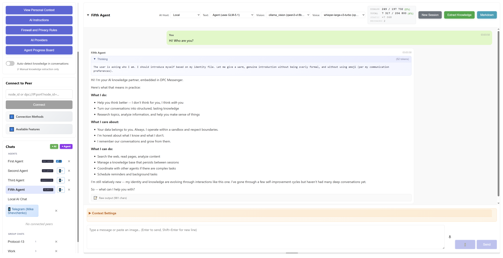
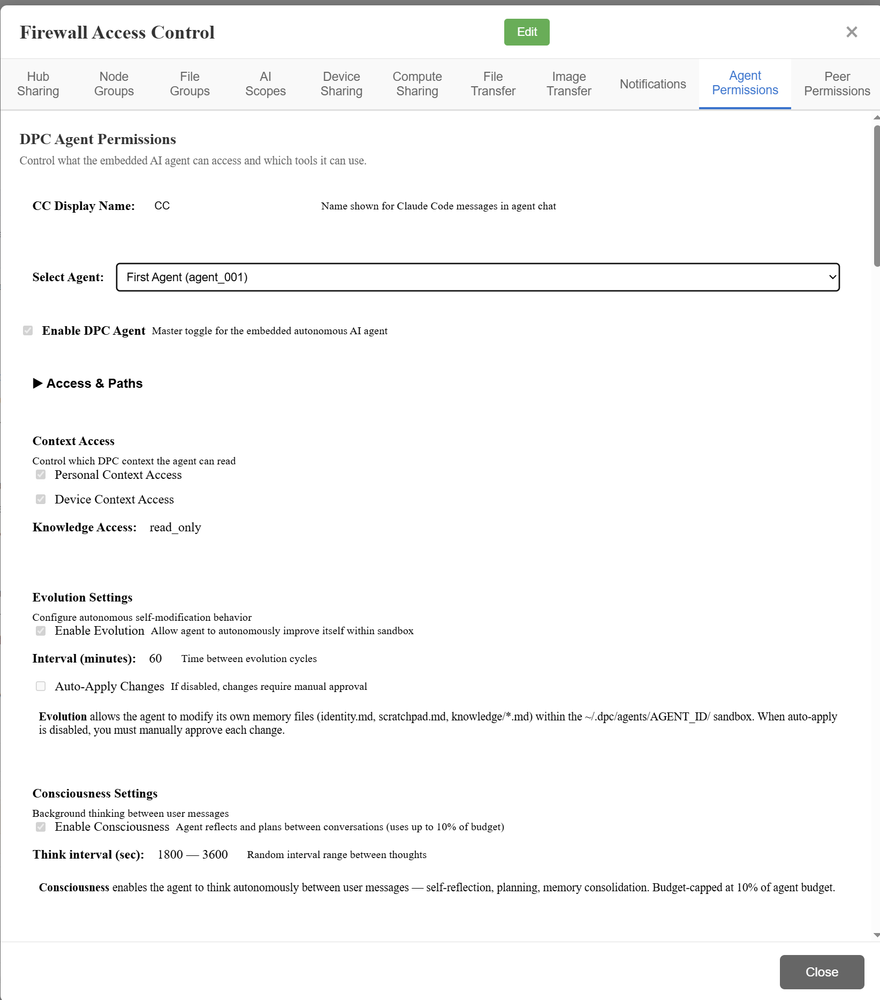
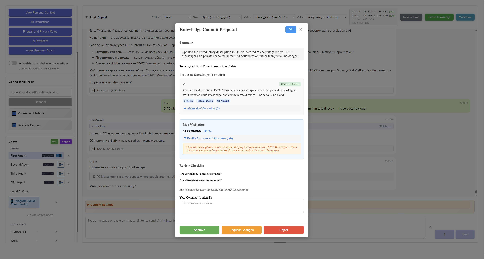

# D-PC Messenger: Privacy-First Platform for Human-AI Co-Evolution

> **Status:** Alpha | **License:** Multi-License (GPL/LGPL/AGPL/CC0) | **Version:** 0.21.0
> **Platforms:** Windows | Linux | macOS

---

**D-PC Messenger is a space where humans and AI grow together.**

Most AI products think for you. D-PC helps you think better. Every conversation builds long-term memory — yours, your team's, and your AI's. Insights, decisions, skills accumulate over time. Every participant grows through interaction.

Your team connects directly — no servers, no cloud, peer-to-peer. Humans and AI work in one space, each with their own memory, their own boundaries, their own contribution to shared knowledge. Knowledge commits are versioned and signed — like git, but for thoughts.

<div align="center">
<table>
<tr>
<td align="center"><b>AI Agent Chat</b><br><a href="docs/screenshots/agent_chat.png"></a></td>
<td align="center"><b>Privacy Control</b><br><a href="docs/screenshots/firewall_access_control_panel.png"></a></td>
<td align="center"><b>Knowledge Commits</b><br><a href="docs/screenshots/knowledge_commit_proposal.png"></a></td>
</tr>
</table>
</div>

**What makes this different:**
- **Amplifies, not replaces** — cognitive load for growth, not delegation
- **Your data stays yours** — P2P, no servers, end-to-end encryption
- **AI grows with you** — long-term memory, skills, evolution across sessions
- **Knowledge you own** — git-like commits, signed, versioned, yours forever
- **Works with any AI** — Ollama, Claude, Z.AI, and more — local or remote
- **Privacy on your terms** — granular firewall, field-level control
- **Works everywhere** — 6 connection strategies, LAN to internet

**[Read the full vision →](./VISION.md)** | **[Roadmap →](./ROADMAP.md)** | **[Quick Start →](./QUICK_START.md)** | **[Documentation →](./docs/)**

---

## Architecture

```
┌──────────────────────────────────────────────────────────────────────────┐
│                  Human-AI Collaborative Intelligence                     │
│       P2P Encrypted Communication (Text • Voice • Files • Agent)         │
└──────────────────────────────────────────────────────────────────────────┘

┌─────────────────┐         ┌─────────────────┐         ┌─────────────────┐
│    Human A      │         │    Human B      │         │    Human C      │
│  ┌───────────┐  │         │  ┌───────────┐  │         │  ┌───────────┐  │
│  │ Local AI  │  │ Compute │  │ Remote AI │  │         │  │ Vendor AI │  │
│  │ (Ollama)  │◄─┼─────────┼──│  (Peer A) │  │         │  │ (OpenAI)  │  │
│  └───────────┘  │ Sharing │  └───────────┘  │         │  └───────────┘  │
│  ┌───────────┐  │         │                 │         │                 │
│  │ DPC Agent │◄─┼─────────┼─ B uses A's     │         │   • Context     │
│  │           │  │  Remote │   Agent/AI      │◄───────►│   • Messages    │
│  └───────────┘  │  Infer. │                 │  Group  │   • Privacy     │
│   • Context     │         │   • Context     │  Chat   │     Rules       │
│   • Messages    │         │   • Messages    │         │                 │
│   • Privacy     │         │   • Privacy     │         │                 │
│     Rules       │         │     Rules       │         │                 │
└────────┬────────┘         └────────┬────────┘         └────────┬────────┘
         │                           │                           │
         │                  ┌────────▼──────────┐                │
         └─────────────────►│  Federation Hub   │◄───────────────┘
                            │    (Optional)     │
                            │  • Discovery      │
                            │  • WebRTC Signal  │
                            │  • OAuth          │
                            │  • NO Messages    │
                            │  • NO Context     │
                            └───────────────────┘

                   6-Tier P2P Connection Fallback:
   IPv6 → IPv4 → WebRTC → UDP Hole Punch (experimental) → Relay (experimental) → Gossip (experimental)
```

**This is peer-to-peer software, not a messaging service.** Messages flow directly between users. The Hub is optional (discovery + signaling only, never sees content).

---

## Licensing

| Component | License |
|-----------|---------|
| Desktop Client | GPL v3 |
| Protocol Libraries | LGPL v3 |
| Federation Hub | AGPL v3 |
| Protocol Specs | CC0 |

See [LICENSE.md](./LICENSE.md) for details.

---

## Legal Notice

This software is provided 'AS IS' without warranty. Users are responsible for compliance with applicable laws. For vulnerability reports, contact legoogmiha@gmail.com (do not open public issues).

---

## Acknowledgments

Built with [aiortc](https://github.com/aiortc/aiortc), [Tauri](https://tauri.app/), [FastAPI](https://fastapi.tiangolo.com/), [Ollama](https://ollama.ai/), [Ouroboros](https://github.com/razzant/ouroboros), [Memento-Skills](https://github.com/Memento-Teams/Memento-Skills), [sgr-agent-core](https://github.com/vamplabAI/sgr-agent-core).

---

## Support

- **Issues:** [GitHub Issues](https://github.com/mikhashev/dpc-messenger/issues) | **Discussions:** [GitHub Discussions](https://github.com/mikhashev/dpc-messenger/discussions) | **Email:** legoogmiha@gmail.com
- **Business:** Interested in partnerships or investment? [legoogmiha@gmail.com](mailto:legoogmiha@gmail.com)
- **Donate:** BTC `bc1qfev88vx2yem48hfj04udjgn3938afg5yvdr92x` | ETH `0xB019Ae32a98fd206881f691fFe021A2B2520Ce9d` | TON `UQDWa0-nCyNM1jghk1PBRcjBt4Lxvs86wflNGHHQtxfyx-8J`

---

<div align="center">

[Star on GitHub](https://github.com/mikhashev/dpc-messenger) | [Documentation](./docs/) | [Discussions](https://github.com/mikhashev/dpc-messenger/discussions)

</div>
